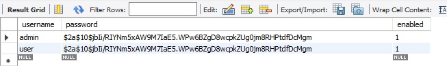
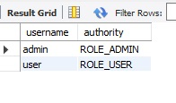

# Spring-Boot-2 basic auth

### create tables in db as below
SELECT * FROM basicauth.user;

SELECT * FROM basicauth.authorities;

## postman collection is attached

* password for both user and admin is password (bcrypted)
user can access only /user

admin access both /user and /admin